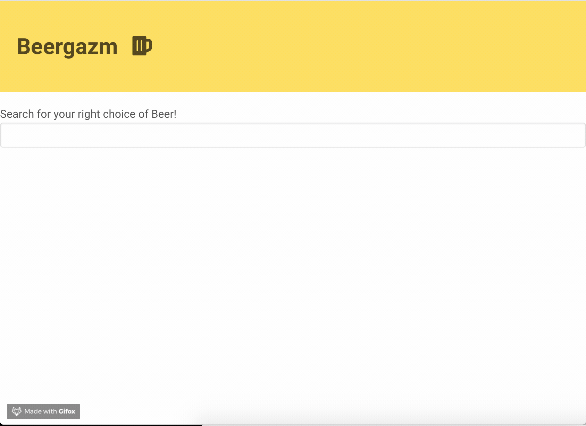

# simple-api-request

1. I got an inspiration from this course [The New Modern Javascript Bootcamp Course (2020)](https://www.udemy.com/course/javascript-beginners-complete-tutorial/)
2. clone this repo and open with live-server.
   
